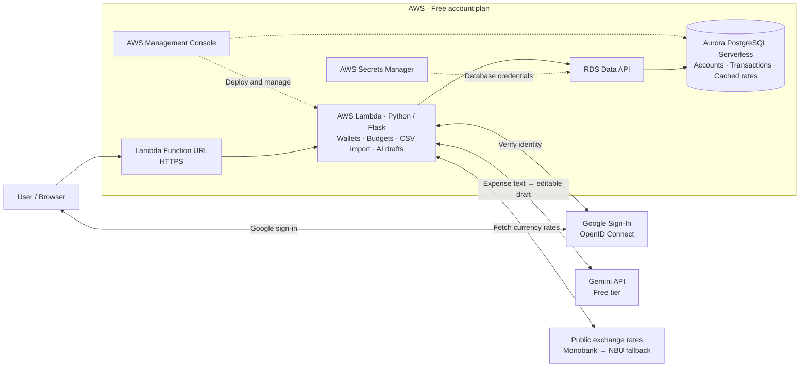

# Pocket Ledger architecture

```mermaid
flowchart LR
    User["User / Browser"]
    Google["Google Sign-In<br/>OpenID Connect"]
    Gemini["Gemini API<br/>Free tier"]
    Rates["Public exchange rates<br/>Monobank → NBU fallback"]

    subgraph AWS["AWS · Free account plan"]
        Console["AWS Management Console"]
        URL["Lambda Function URL<br/>HTTPS"]
        App["AWS Lambda · Python / Flask<br/>Wallets · Budgets · CSV import · AI drafts"]
        Data["RDS Data API"]
        DB[("Aurora PostgreSQL Serverless<br/>Accounts · Transactions · Cached rates")]
        Secrets["AWS Secrets Manager"]

        Console -. "Deploy and manage" .-> App
        Console -.-> DB
        URL --> App
        App --> Data --> DB
        Secrets -. "Database credentials" .-> Data
    end

    User --> URL
    User <-->|"Google sign-in"| Google
    App <-->|"Verify identity"| Google
    App <-->|"Expense text → editable draft"| Gemini
    App <-->|"Fetch currency rates"| Rates
```
